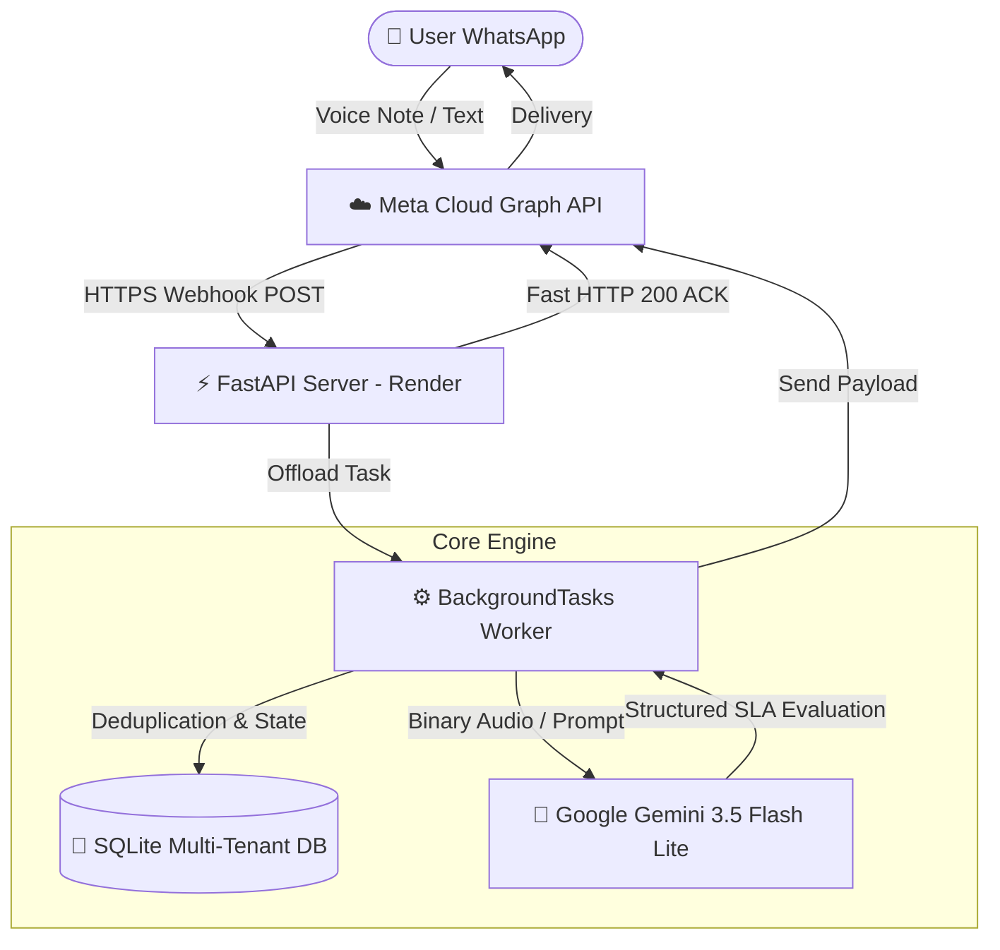

# 🚀 AI Technical English Tutor (Multi-Tenant)

[](https://fastapi.tiangolo.com/)
[](https://ai.google.dev/)
[](https://developers.facebook.com/)
[](https://render.com/)
[](https://www.sqlite.org/)

An automated, event-driven multimodal tutoring service delivered via WhatsApp. Designed specifically for software engineering students and developers bridging the proficiency gap from intermediate levels (A1–B1) to workplace fluency (B2–C1) in international tech environments.

---

## 📌 Architecture & System Flow

The service implements an **Asynchronous Event-Driven Architecture (EDA)** operating 24/7 on cloud infrastructure:



---

## 🧠 Key Engineering Decisions

* **Asynchronous Webhook Processing (`BackgroundTasks`):** Meta requires webhooks to return `HTTP 200 OK` within a strict timeout window. Audio processing and LLM inference are offloaded to asynchronous background tasks, preventing webhook retry storms.
* **In-Memory Binary Audio Streaming:** WhatsApp voice notes (`.ogg` Opus) are streamed directly into memory buffers and passed as raw byte payloads to Gemini's multimodal endpoint, eliminating disk I/O bottlenecks.
* **Idempotency & Message Deduplication:** Every webhook event is verified against a persistent transaction table (`processed_messages`) to discard duplicates caused by network retries.
* **Multi-Tenant State Machine (FSM):** Supports isolated per-user state tracking, conversational history, and dynamic configuration via in-chat commands without cross-talk.
* **SLA-Driven Pedagogical Design:** Implements Second Language Acquisition principles:
  * **Krashen's $i+1$ Comprehensible Input:** Content automatically adjusts to the user's target level (A1 to C1).
  * **Corrective Feedback (Recasting):** Provides technical corrections suitable for daily standups, PR reviews, and incident reports.

---

## 🛠️ In-Chat Commands (WhatsApp Interface)

Users configure their personal tutor directly via chat:

| Command | Description | Example |
| :--- | :--- | :--- |
| `/level <A1-C1>` | Dynamically scales curriculum complexity | `/level B2` |
| `/focus <Area>` | Customizes technical terms and drills | `/focus DevOps` |
| `/status` | Returns active learning parameters and profile | `/status` |
| `/start` | Immediately triggers the daily lesson | `/start` |
| `/help` | Displays the operational command menu | `/help` |

---

## ⚙️ Environment Variables

Configure the following secrets in your deployment dashboard or local `.env`:

```env
META_TOKEN="your_permanent_system_user_token"
PHONE_NUMBER_ID="your_whatsapp_phone_number_id"
GEMINI_API_KEY="your_google_ai_studio_key"
VERIFY_TOKEN="your_webhook_verification_secret"
PORT=8000
```

---

## 🚀 Local Development Setup

1. **Clone the repository:**
   ```bash
   git clone [https://github.com/tobias-benitez/ai-tech-english-tutor.git](https://github.com/tobias-benitez/ai-tech-english-tutor.git)
   cd ai-tech-english-tutor
   ```

2. **Create and activate a virtual environment:**
   ```bash
   python -m venv venv
   # Windows:
   .\venv\Scripts\activate
   # macOS/Linux:
   source venv/bin/activate
   ```

3. **Install dependencies:**
   ```bash
   pip install -r requirements.txt
   ```

4. **Run the server:**
   ```bash
   python server.py
   ```
